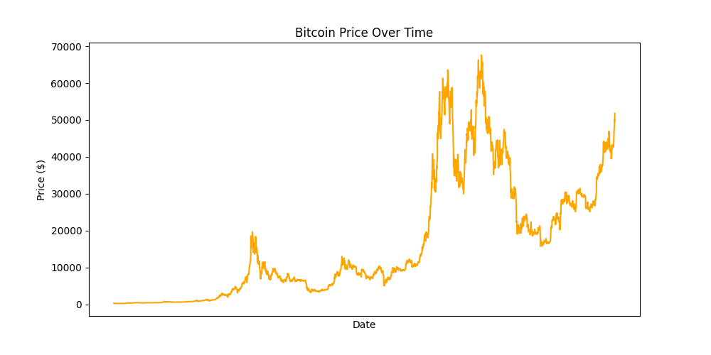
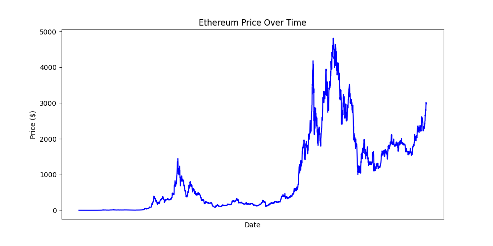
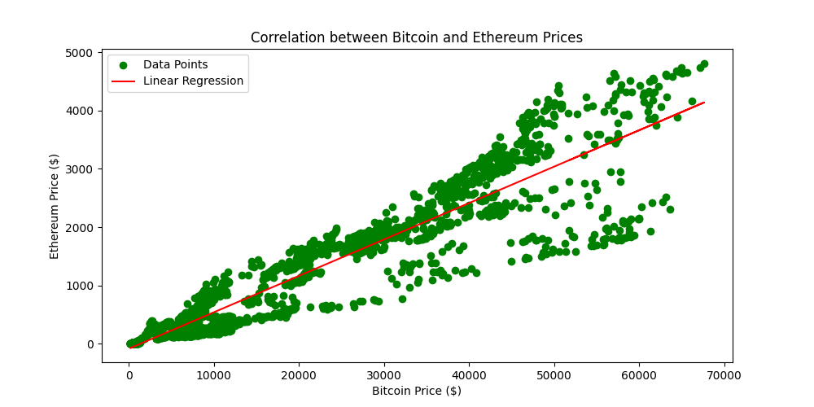

### Задание # 1:
Определите собственные движения цены фьючерса ETHUSDT, исключив из них движения вызванные влиянием цены BTCUSDT.
Опишите, какую методику вы выбрали, какие параметры подобрали, и почему.

### Задание # 2:
Напишите программу на Python, которая в реальном времени (с минимальной задержкой) следит за ценой фьючерса ETHUSDT
и используя выбранный вами метод, определяет собственные движение цены ETH. При изменении цены на 1% за последние 
60 минут, программа выводит сообщение в консоль. При этом программа должна продолжать работать дальше, постоянно 
считывая актуальную цену.

----

### Задание #1 решение:
Графики цены криптовалют демонстрируют, что зависимость между BTCUSDT и ETHUSDT существует, и имеет линейный характер.

<p float="left" align="center">
    
    
    
</p>

Данные графиков состоят из ежедневных значений соответствующих фьючерсов. 

```python
correlation, p_value = pearsonr(BTC, ETH)
print("Pearson's product-moment correlation:")
print(f"Correlation: {correlation:.4f}")
print(f"P-value: {p_value}")

>>> Pearson's product-moment correlation:
>>> Correlation: 0.9418
>>> P-value: 0.0
```

P-value равное "0" (максимально близкое к нему), позволяет использовать линейную регрессию для прогнозирования
стоимости ETHUSDT на основе значений BTCUSDT.

Остатки между реальными и прогнозируемыми значениями интерпретируются как _собственные движения_ цен ETHUSDT.

### Задание #2 решение:
...

### Использование:
...